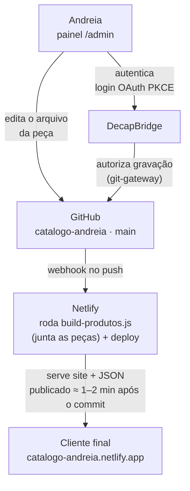

# Documentação técnica do catálogo e do painel admin

**ELIDAVY TECH · Referência interna**

Como o site, os dados de produto e o painel de edição da Andreia Pateis funcionam por
baixo do capô — pra consultar sempre que precisar mexer no projeto ou explicar uma
decisão pra alguém.

*Netlify + DecapBridge · Site estático, sem framework · Atualizado em 01/09/2026*

## Sumário

- [Sobre este documento](#sobre-este-documento)
- [01. Visão geral](#01-visão-geral)
- [02. Arquitetura](#02-arquitetura)
- [03. Fluxo de edição, passo a passo](#03-fluxo-de-edição-passo-a-passo)
- [04. Estrutura de pastas](#04-estrutura-de-pastas)
- [05. Painel admin](#05-painel-admin)
- [06. Decisões arquiteturais (ADRs)](#06-decisões-arquiteturais-adrs)
- [07. Segurança e acesso](#07-segurança-e-acesso)
- [08. Débito técnico conhecido](#08-débito-técnico-conhecido)
- [09. Histórico recente](#09-histórico-recente)

---

## Sobre este documento

Este documento descreve o **estado atual** do projeto — arquitetura, schema, fluxo de
deploy. É o complemento do índice de decisões em [`docs/adr/`](./adr/): lá fica o
*porquê* de cada escolha, registrado uma vez, no momento em que foi tomada, e nunca mais
editado depois de aceito; aqui fica o *o quê*, e este arquivo deve ser reescrito sempre
que necessário para continuar refletindo como o projeto funciona hoje, não como
funcionou no passado.

**Quando atualizar:** ao adicionar, remover ou mudar um campo do schema do produto
(§05); ao aceitar um ADR novo (acrescentar uma linha na tabela de §06 com um resumo de
2–3 frases e link para o arquivo — nunca copiar o texto completo do ADR pra cá, isso é o
que causa desatualização silenciosa); ao mudar a arquitetura, o fluxo de deploy ou a
estrutura de pastas (§02–§04); ao resolver ou identificar um item de débito técnico
(§08); ao mudar algo relacionado a segurança (§07).

**Como atualizar:** edite a seção correspondente diretamente neste arquivo, atualize a
data "Atualizado em" no topo, e — se a mudança for relevante para quem só lê por cima —
acrescente uma linha em §09.

## 01. Visão geral

O catálogo da Andreia Pateis é um site estático (HTML + CSS + JavaScript puro, sem
framework) hospedado no Netlify, com deploy automático a cada alteração enviada ao
GitHub. Cada peça vive em seu próprio arquivo JSON, dentro de
[`public/data/produtos/pecas/`](../public/data/produtos/pecas/) — não há banco de dados
externo. A Andreia edita cada peça sem tocar em código, através de um painel visual
(Decap CMS) que salva as mudanças direto no GitHub por trás dos panos; a cada
publicação, um script (`scripts/build-produtos.js`) junta todos os arquivos de peça num
único [`produtos.json`](../public/data/produtos/produtos.json), que é o arquivo que o
site de fato consulta (ver [ADR-0011](./adr/0011-folder-collection-um-arquivo-por-peca.md)).

Três serviços externos sustentam esse fluxo, cada um com um papel específico:

- **GitHub** — guarda o código-fonte e o arquivo de produtos; toda alteração vira um
  commit no histórico.
- **Netlify** — publica o site ao público e refaz o deploy automaticamente a cada novo
  commit em `main`.
- **DecapBridge** — cuida do login do painel admin (Google, Microsoft ou e-mail/senha) e
  autoriza o Decap CMS a gravar no GitHub em nome de quem está logado.

## 02. Arquitetura

Não existe backend próprio nem servidor sob gestão — os três serviços acima é que fazem
esse papel.



O painel admin nunca fala diretamente com o site publicado. Ele grava um commit no
GitHub; é o Netlify, observando esse repositório, quem detecta o push e refaz o deploy —
por isso uma edição no painel leva cerca de um a dois minutos para aparecer no site.

**Frontend público:** SPA (Single Page Application) em JavaScript puro. `index.html`
carrega [`script.js`](../public/js/script.js), que busca
[`produtos.json`](../public/data/produtos/produtos.json) por fetch assim que a página
abre e monta a grade, o carrinho e a ficha de cada produto inteiramente no navegador —
sem etapa de build.

**Fonte de dados:** cada peça é um arquivo JSON próprio em
[`public/data/produtos/pecas/`](../public/data/produtos/pecas/) — é aí que a Andreia
realmente cadastra e edita, e é isso que fica versionado como histórico real de cada
peça (ver [ADR-0011](./adr/0011-folder-collection-um-arquivo-por-peca.md)). O arquivo
[`produtos.json`](../public/data/produtos/produtos.json) que o site consome é *gerado*,
não editado à mão: ele é regravado do zero a cada publicação pelo script
`scripts/build-produtos.js`, então uma cópia dele parada no histórico do Git pode ficar
desatualizada entre uma publicação e outra sem que isso afete o site (ver §08). Não há
Firestore, nem qualquer outro banco externo.

## 03. Fluxo de edição, passo a passo

O que acontece tecnicamente entre a Andreia clicar em "Publicar" no painel e a alteração
aparecer no site:

1. Ela loga em `/admin` pelo Google, Microsoft ou e-mail/senha — o DecapBridge confere a
   identidade e devolve um token de acesso via OAuth PKCE.
2. O Decap CMS usa esse token pra falar com o git-gateway do DecapBridge, que tem
   permissão de gravação no repositório `catalogo-andreia` no GitHub.
3. Ao salvar, o painel grava (ou atualiza) só o arquivo JSON daquela peça, dentro de
   `public/data/produtos/pecas/`, e cria um commit direto na branch `main` — sem passar
   pelo computador de ninguém.
4. O GitHub avisa o Netlify (via webhook) que a `main` mudou.
5. O Netlify roda o comando de build definido em `netlify.toml`
   (`node scripts/build-produtos.js`), que junta todos os arquivos de
   `public/data/produtos/pecas/` num `produtos.json` novo, e então publica o conteúdo da
   pasta `public/` — não é um build no sentido de React/Next/Vite, é só essa junção de
   arquivos, rápida.
6. Na próxima vez que alguém abrir o catálogo, o `script.js` busca o `produtos.json`
   recém-gerado e a mudança aparece.

**Importante:** como o commit vai direto pro GitHub a partir do painel, um computador
que tenha o projeto clonado localmente (como o seu) pode ficar "atrasado" em relação ao
repositório remoto sempre que alguém usa o painel. É por isso que às vezes é preciso
rodar `git pull` antes de um `git push` — o Git está evitando que uma alteração local
sobrescreva sem querer uma edição feita pelo painel.

## 04. Estrutura de pastas

Só o que importa para operar o projeto — pastas de dependências e controle de versão
foram omitidas.

```
public/                          ← única pasta que o Netlify publica
  index.html                     catálogo (a página que o cliente final vê)
  favicon.png                    logo "AP"; também usado como imagem de
                                  compartilhamento (og:image / twitter:image)
  _headers                       cabeçalhos de segurança e CSP (ver §07)
  css/style.css
  js/script.js
  data/produtos/
    pecas/*.json                 ← fonte real: um arquivo por peça (ver ADR-0011)
    produtos.json                ← gerado a cada build por scripts/build-produtos.js;
                                    não editar à mão (ver §02, §08)
  images/                        fotos dos produtos, upload feito pelo painel
  admin/
    index.html                   carrega o Decap CMS
    config.yml                   define os campos do formulário de peça
docs/adr/                        registro das decisões arquiteturais (ver §06)
scripts/
  build-produtos.js              roda a cada publicação (ver netlify.toml) — junta as
                                  peças de public/data/produtos/pecas/ num produtos.json
  dividir-produtos-em-arquivos.js  uso único, já rodado (ADR-0011) — dividiu o antigo
                                  produtos.json num arquivo por peça
  reestruturar-produtos-json.js  uso único, já rodado — ajustou o formato do produtos.json
                                  ao que o Decap CMS espera
netlify.toml                     comando de build: node scripts/build-produtos.js
package.json                     hoje sem dependências
```

Os arquivos mais consultados no dia a dia são
[`public/admin/config.yml`](../public/admin/config.yml) (schema da peça), os arquivos
individuais em [`public/data/produtos/pecas/`](../public/data/produtos/pecas/) (os dados
reais de cada peça) e [`public/js/script.js`](../public/js/script.js) (a lógica de
exibição). O `produtos.json` na raiz de `data/produtos/` não deve ser editado
diretamente — é saída de build, não fonte (ver §08).

## 05. Painel admin

O painel é o Decap CMS (antigo Netlify CMS), configurado inteiramente pelo arquivo
[`public/admin/config.yml`](../public/admin/config.yml). Ele define uma única coleção,
`produtos`, do tipo *folder collection*: cada peça é salva como um arquivo JSON
independente dentro de
[`public/data/produtos/pecas/`](../public/data/produtos/pecas/) (ver
[ADR-0011](./adr/0011-folder-collection-um-arquivo-por-peca.md)). Cada peça tem os
campos abaixo, na ordem em que aparecem no formulário — mudar essa lista é a forma de
mudar o que a Andreia consegue preencher:

| Campo | Tipo | Observação |
|---|---|---|
| `nome` | texto | obrigatório |
| `disponivel` | sim/não | opcional, padrão ativado — esconde a peça da vitrine sem apagar o cadastro (soft-hide); peças cadastradas antes desse campo existir continuam visíveis normalmente, mas o painel mostra o interruptor desligado nelas até serem reabertas e publicadas de novo (ver [ADR-0012](./adr/0012-campo-disponivel-soft-hide-sem-exclusao.md)) |
| `preco` | número | obrigatório, aceita casas decimais |
| `descricao` | texto longo | obrigatório |
| `categoria` | seleção única | lista fixa: Conjunto, Sutiã, Calcinha, Pijama, Cueca, Meia, Camisola |
| `estacao` | seleção única | opcional, só relevante quando `categoria` é Pijama — Verão ou Inverno; alimenta o sub-filtro de estação no site (ver [ADR-0003](./adr/0003-categoria-estacao-campos-separados.md), incluindo o adendo de 31/08/2026) |
| `cores` | seleção múltipla | ~70 cores específicas, agrupadas em 10 famílias (rosas, vermelhos, laranjas, amarelos, verdes, azuis, roxos, nudes/terrosos, neutros, pretos), cada uma associada a um de 24 tons-base no `script.js` (ver [ADR-0008](./adr/0008-paleta-de-cores-curada-com-nomes-especificos.md)) |
| `tamanhos` | seleção múltipla | PP, P, M, G, GG, 48, 50, 52, 54, Único |
| `imagem` | upload de imagem | opcional — sem foto, o site mostra um ícone de roupa |
| `com_modelo` | sim/não | controla se a foto mostra uma pessoa vestindo a peça; determina o agrupamento automático na exibição do catálogo, independente da ordem de cadastro (ver [ADR-0009](./adr/0009-tag-com-modelo-e-ordenacao-na-exibicao.md)) |
| `imagens_por_cor` | lista (cor + imagem) | opcional — troca a foto exibida quando o cliente seleciona uma cor específica da peça; cada entrada associa uma das ~70 cores a uma imagem |
| `destaque` | sim/não | controla o carrossel da tela inicial (exige foto também) |

**Autenticação do painel:** `backend: git-gateway` com `auth_type: pkce` apontando para
`auth.decapbridge.com`. Colaboradores são convidados por e-mail direto no painel do
DecapBridge (decapbridge.com → Gerenciar colaboradores) — é um convite de uso único,
separado do login recorrente de cada pessoa.

## 06. Decisões arquiteturais (ADRs)

O projeto documenta decisões difíceis de reverter em [`docs/adr/`](./adr/) — a regra do
projeto é nunca editar um ADR aceito para "corrigi-lo"; se uma decisão muda, um novo ADR
é criado e o antigo é marcado como substituído, preservando o porquê de cada mudança de
rumo. A tabela abaixo é só um índice; o raciocínio completo (contexto, alternativas
descartadas, consequências) fica sempre no arquivo original, para não duplicar conteúdo
que ficaria desatualizado aqui se o ADR fosse revisto no futuro.

| ADR | Título | Status |
|---|---|---|
| [0001](./adr/0001-prototipo-single-file-antes-producao.md) | Protótipo em arquivo único antes da arquitetura de produção | Aceito |
| [0002](./adr/0002-hospedagem-firebase-hosting.md) | Hospedagem em Firebase Hosting | Substituído por 0007 |
| [0003](./adr/0003-categoria-estacao-campos-separados.md) | Categoria e estação como campos separados (filtro facetado) | Aceito |
| [0004](./adr/0004-checkout-via-whatsapp-wa-me.md) | Finalização de pedido via link wa.me, sem checkout próprio | Aceito |
| [0005](./adr/0005-adiar-ssr-ssg-e-refactor-camadas.md) | Adiar migração para SSR/SSG e separação de camadas | Aceito |
| [0006](./adr/0006-gestao-de-credenciais.md) | Gestão de credenciais em repositórios públicos | Aceito |
| [0007](./adr/0007-hospedagem-netlify-remocao-firebase.md) | Hospedagem definitiva no Netlify — remoção do Firebase | Aceito |
| [0008](./adr/0008-paleta-de-cores-curada-com-nomes-especificos.md) | Paleta de cores curada, com nomes específicos por peça | Aceito |
| [0009](./adr/0009-tag-com-modelo-e-ordenacao-na-exibicao.md) | Classificação "com modelo / sem modelo" como campo de dados, não como ordem no arquivo | Aceito |
| [0010](./adr/0010-auditoria-seguranca-firebase-xss-headers.md) | Auditoria de segurança — exclusão do Firebase abandonado, escape de saída e cabeçalhos de segurança | Aceito |
| [0011](./adr/0011-folder-collection-um-arquivo-por-peca.md) | Migração de coleção única para folder collection (um arquivo JSON por peça) no Decap CMS | Aceito |
| [0012](./adr/0012-campo-disponivel-soft-hide-sem-exclusao.md) | Campo "disponível" como soft-hide de peça, sem exclusão do cadastro | Aceito |

### Resumo das decisões mais significativas

**Hospedagem: Firebase → Netlify** ([ADR-0002](./adr/0002-hospedagem-firebase-hosting.md),
substituído por [ADR-0007](./adr/0007-hospedagem-netlify-remocao-firebase.md)). O plano
original de protótipo (04/08/2026) era hospedar no Firebase Hosting, no mesmo
ecossistema do Firestore/Firebase Authentication cogitados para produção. Na prática o
deploy real sempre foi pelo Netlify — o Firestore foi abandonado e o Firebase Hosting
nunca chegou a ser usado de verdade. O ADR-0007 (22/08/2026) formalizou o Netlify como
hospedagem definitiva e removeu todo artefato morto do Firebase do repositório.

**Paleta de cores curada** ([ADR-0008](./adr/0008-paleta-de-cores-curada-com-nomes-especificos.md),
22/08/2026). A lista original de 10 cores fixas não representava a variedade real das
peças da Andreia. Foi adotado um sistema em duas camadas: 24 tons-base (com hex extraído
da identidade visual da marca) por trás de ~70 nomes específicos agrupados em 10
famílias, que são as opções reais do campo `cores` no painel — sem mudar a forma como a
Andreia usa o formulário.

**Organização com/sem modelo no catálogo** ([ADR-0009](./adr/0009-tag-com-modelo-e-ordenacao-na-exibicao.md),
23/08/2026). Uma importação em massa misturou peças com e sem modelo na grade, porque a
exibição sempre segue a ordem do array em `produtos.json` — e o painel sempre adiciona
produtos novos no final desse array. Foi adicionado o campo `com_modelo` ao schema,
aplicado retroativamente aos 106 produtos existentes, e `script.js` passou a ordenar a
exibição por esse campo a cada carregamento — a organização deixa de depender da ordem
de cadastro.

**Auditoria de segurança — Firebase, XSS e cabeçalhos** ([ADR-0010](./adr/0010-auditoria-seguranca-firebase-xss-headers.md),
24/08/2026). Uma auditoria encontrou o projeto Firebase abandonado ainda ativo, com
regras do Firestore abertas ao público até 11/09/2026, além de texto de produto sendo
inserido em HTML sem escape (risco de XSS) e nenhum cabeçalho de segurança configurado.
O projeto Firebase foi excluído por completo, `script.js` passou a escapar todo texto de
produto antes de inserir no HTML, e `public/_headers` passou a aplicar
Content-Security-Policy e cabeçalhos padrão de segurança ao catálogo público (deixando o
`/admin` de fora do CSP, por depender de um CDN externo para carregar o Decap CMS).

**Um arquivo por peça, não mais uma lista única** ([ADR-0011](./adr/0011-folder-collection-um-arquivo-por-peca.md),
24/08/2026). Com o catálogo passando de 100 peças, o painel ficava lento pra abrir e
salvar (a lista inteira precisava recarregar a cada edição), e chegou a ocorrer um erro
de "No Entries". A coleção `produtos` foi migrada de uma lista única dentro de
`produtos.json` para uma *folder collection*: cada peça virou seu próprio arquivo JSON
em `public/data/produtos/pecas/`. Um script novo (`scripts/build-produtos.js`, rodado a
cada publicação pelo Netlify) junta esses arquivos de volta num `produtos.json` — o site
não mudou nada do ponto de vista de quem compra.

**Campo `disponivel` (soft-hide)** ([ADR-0012](./adr/0012-campo-disponivel-soft-hide-sem-exclusao.md),
27/08/2026). Antes, a única forma de tirar uma peça da vitrine era excluir o cadastro
inteiro — perdendo fotos, preço e descrição, sem chance de reativar depois. Foi
adicionado o campo booleano `disponivel` (padrão `true`), e `script.js` passou a
filtrar `p.disponivel !== false` antes de montar a vitrine — peças cadastradas antes
desse campo existir continuam aparecendo normalmente. Atenção: no painel, uma peça
antiga sem esse valor salvo mostra o interruptor desligado na tela mesmo continuando
visível no site — é preciso conferir esse campo antes de publicar a edição de uma peça
antiga, pra não escondê-la sem querer.

**Campo `estacao`, completando a ADR-0003** (31/08/2026). O sub-filtro Verão/Inverno da
categoria Pijama, previsto desde 06/08/2026, tinha a lógica pronta no `script.js` mas
nenhum campo no painel pra alimentá-la — o sub-filtro existia, porém não filtrava nada
de fato (a grade ficava vazia ao clicar em Verão ou Inverno). Identificado ao testar o
filtro direto no catálogo publicado, o campo `estacao` foi adicionado ao `config.yml` e
`script.js` passou a lê-lo (`season: p.estacao`). Não foi necessário um novo ADR — a
decisão já estava tomada, faltava só a implementação (ver adendo de 31/08/2026 na
própria [ADR-0003](./adr/0003-categoria-estacao-campos-separados.md)).

Os demais ADRs (0001, 0003–0006) descrevem decisões de produto e de processo que
continuam válidas como estão — protótipo em arquivo único antes de investir em
infraestrutura, categoria/estação como filtro facetado, checkout via WhatsApp em vez de
gateway de pagamento próprio, SSR/SSG adiado até a fase de produção, e a prática de
nunca commitar credenciais. O histórico completo está em [`docs/adr/`](./adr/).

## 07. Segurança e acesso

**O repositório é público.** `github.com/elieltonsouzadossantos/catalogo-andreia` é
público — necessário para o deploy automático do Netlify. Qualquer pessoa com o link vê
todo o histórico de commits e todos os arquivos rastreados. Nenhuma credencial (chave de
API, senha, token) pode ser commitada, nunca — nem temporariamente. O
[`.gitignore`](../.gitignore) protege nomes exatos de arquivo já problemáticos
(`serviceAccountKey.json`, `firebase-debug.log`) e também padrões genéricos
(`*serviceAccount*`, `*.pem`, `*.p12`, `.env`, `.env.*`), ampliados na auditoria de
segurança de 24/08/2026 (ver [ADR-0010](./adr/0010-auditoria-seguranca-firebase-xss-headers.md)).

**Proteção contra XSS.** Todo texto de produto vindo do `produtos.json` (`nome`,
`descricao`, caminho da foto) passa por escape antes de ser inserido no HTML — funções
`escapeHTML` e `escapeForInlineHandler` em [`script.js`](../public/js/script.js). Os
campos de vocabulário fechado do painel (categoria, cor, tamanho) ficaram de fora por
não serem texto livre. Qualquer novo trecho de renderização que insira texto de produto
em HTML deve usar essas funções.

**Cabeçalhos de segurança e CSP.** [`public/_headers`](../public/_headers) aplica
X-Frame-Options, X-Content-Type-Options, Referrer-Policy e Permissions-Policy a todo o
site, e um Content-Security-Policy às rotas `/` e `/index.html` — deliberadamente não ao
`/admin`, que depende de um CDN externo (`unpkg.com`) para carregar o Decap CMS.
Limitações conhecidas dessa política em [ADR-0010](./adr/0010-auditoria-seguranca-firebase-xss-headers.md)
e em §08.

**Firebase abandonado, removido por completo.** O projeto Firebase "andreia-pateis",
cujo código morto foi removido do repositório em 22/08/2026 ([ADR-0007](./adr/0007-hospedagem-netlify-remocao-firebase.md)),
continuava existindo como recurso de nuvem — com dado remanescente e regras do Firestore
abertas ao público (`allow read, write: if true` até 11/09/2026, o padrão de "modo de
teste" do Firebase). Foi excluído por completo em 24/08/2026
([ADR-0010](./adr/0010-auditoria-seguranca-firebase-xss-headers.md)); não há mais nenhum
serviço Firebase associado ao projeto.

**Acesso ao painel admin.** Só entra quem foi convidado como colaborador pelo
DecapBridge (decapbridge.com → Gerenciar colaboradores). Cada convite é um token de uso
único; depois disso, a pessoa loga normalmente com sua própria conta Google, Microsoft
ou e-mail/senha. Hoje têm acesso: Elielton (desenvolvedor) e Andreia (cliente/dona do
negócio).

**Acesso ao repositório.** O git-gateway do DecapBridge grava commits em nome de quem
está logado no painel — é essa integração, e não uma conta pessoal do GitHub, que tem
permissão de escrita. Acesso direto de escrita ao repositório (via terminal) deve
continuar restrito a quem desenvolve o projeto.

## 08. Débito técnico conhecido

Nada aqui quebra o site em produção — são pontos que valem a pena revisitar numa
próxima passada de limpeza.

**Baixo — Comentários desatualizados em `script.js`.** Dois comentários no código ainda
mencionam Firestore/Firebase (ex.: "Enquanto o catálogo carrega do Firestore..."), mas
os dados já vêm só do `produtos.json` local há tempos. Não afeta o funcionamento, só
pode confundir quem ler o código sem o contexto.

**Baixo — [`package-lock.json`](../package-lock.json) desatualizado.** Ainda referencia
a dependência `firebase-admin`, já removida do [`package.json`](../package.json). Rodar
`npm install` localmente (no seu terminal, não pelo ambiente de automação) regenera o
arquivo corretamente.

**Baixo — Pasta `admin/` vazia na raiz do projeto.** Sobra do local antigo do painel,
antes de mover para `public/admin/` (correção do 404 documentada no histórico do
projeto). Não é rastreada pelo Git — pode ser apagada manualmente sem nenhum risco.

**Baixo — CSP ainda permite script inline (`'unsafe-inline'`).** O site usa
`onclick="..."` inline extensivamente (padrão herdado do protótipo original), então o
Content-Security-Policy em [`public/_headers`](../public/_headers) precisou manter
`'unsafe-inline'` no `script-src` pra não quebrar a interface. Isso limita a proteção
real do CSP contra XSS — ele restringe de onde scripts externos podem carregar, mas não
bloqueia script inline. Resolver de verdade exigiria trocar o padrão de `onclick` inline
por `addEventListener` em todo o `script.js`, um refactor maior. Ver
[ADR-0010](./adr/0010-auditoria-seguranca-firebase-xss-headers.md).

**Médio — Sem registro automático de pedidos.** Por decisão do
[ADR-0004](./adr/0004-checkout-via-whatsapp-wa-me.md), o checkout acontece via WhatsApp
— não existe nenhum banco de dados de pedidos, relatório de vendas ou controle de
estoque automatizado. Se o volume de vendas crescer, vale revisitar essa decisão.

**Médio — Sem SEO — catálogo não aparece bem no Google.** Por decisão do
[ADR-0005](./adr/0005-adiar-ssr-ssg-e-refactor-camadas.md), a migração para SSR/SSG (que
daria uma URL própria e indexável a cada produto) foi adiada até a fase de produção.
Enquanto isso não muda, o catálogo depende de divulgação direta (WhatsApp, Instagram,
link direto), não de busca orgânica.

**Baixo — `produtos.json` versionado no Git pode ficar desatualizado.** O arquivo
[`public/data/produtos/produtos.json`](../public/data/produtos/produtos.json) é gerado
a cada build pelo `scripts/build-produtos.js` (ver §02, §04) e não é gravado de volta no
Git — a cópia que fica no histórico do repositório só muda se alguém a commitar
manualmente, o que não acontece mais desde a migração da [ADR-0011](./adr/0011-folder-collection-um-arquivo-por-peca.md).
Verificado em 31/08/2026: a cópia commitada tinha 106 entradas, incluindo nomes de teste
antigos ("Peça 1 (editar)" etc.), enquanto o catálogo real tinha 105 arquivos de peça —
uma diferença que só aparece pra quem lê esse arquivo direto do Git; o site publicado
sempre usa a versão gerada na hora do build, nunca a commitada. Ideal seria adicionar
esse arquivo ao `.gitignore` (é saída de build, não deveria ser rastreado) — ainda não
feito porque exige confirmar antes que nada mais no projeto depende dele estar
versionado.

**Baixo — cópias antigas de scripts dentro de `public/data/produtos/pecas/`.** Os
arquivos `build-produtos.js` e `dividir-produtos-em-arquivos.js` existem, idênticos,
tanto em `scripts/` (local correto e ativo) quanto dentro da própria pasta de dados
`public/data/produtos/pecas/` (sobra do commit original de 24/08/2026, nunca removida).
Não quebra nada — `build-produtos.js` ignora qualquer arquivo que não termine em
`.json` ao montar `produtos.json` — mas é limpeza pendente: os dois arquivos podem ser
apagados de dentro de `pecas/` sem risco.

**Médio — Fotos sem carregamento sob demanda nem compressão automática.** Hoje o site
carrega a foto de todo produto assim que o catálogo abre (sem lazy loading), e o painel
não redimensiona nem comprime a imagem que a Andreia envia — uma foto direto da câmera
do celular pode passar de 3–4MB. Isso não é um risco imediato (levantamento feito em
22/08/2026: com fotos otimizadas o catálogo aguenta milhares de produtos antes do
armazenamento do GitHub/Netlify virar problema), mas é o que mais rápido consumiria os
100GB de tráfego mensal do plano gratuito do Netlify conforme o catálogo cresce, e
deixaria o carregamento mais lento no celular do cliente. Vale resolver antes do
catálogo crescer bastante: adicionar carregamento sob demanda das imagens e orientar
(ou automatizar) fotos num tamanho mais leve.

## 09. Histórico recente

Os três commits que tiraram o Firebase do projeto e alinharam a documentação à
infraestrutura real (22/08/2026):

- [`1a1b82b`](https://github.com/elieltonsouzadossantos/catalogo-andreia/commit/1a1b82b)
  — Remove pasta `migraçao/` (página de migração única para Firestore, já concluída):
  `migrate.html` e `migrate-data.js` — código morto, importava um `firebase-config.js`
  que já nem existia mais.
- [`7087231`](https://github.com/elieltonsouzadossantos/catalogo-andreia/commit/7087231)
  — Remove scripts de teste/migração do Firebase Admin: `teste-require.js`,
  `teste-admin.js`, `exportar-produtos.js` + dependência `firebase-admin` removida do
  `package.json`.
- [`cb28c1a`](https://github.com/elieltonsouzadossantos/catalogo-andreia/commit/cb28c1a)
  — Remove configuração do Firebase não utilizada e documenta em ADR-0007:
  `firebase.json`, `.firebaserc`, `.firebase/`, `firebase-config.js`,
  `serviceAccountKey.json` local.

**Mudanças de 23/08/2026** (organização do catálogo e compartilhamento do link):

- Campo `com_modelo` adicionado ao schema (`config.yml`) e aplicado retroativamente aos
  106 produtos existentes; `script.js` passou a agrupar a exibição por esse campo.
- `favicon.png` recentralizado (o logo estava deslocado dentro do quadrado da imagem).
- Tags Open Graph e Twitter Card adicionadas em `index.html`, corrigindo o preview do
  link do catálogo ao compartilhar no WhatsApp e redes sociais.
- [`docs/adr/0009-tag-com-modelo-e-ordenacao-na-exibicao.md`](./adr/0009-tag-com-modelo-e-ordenacao-na-exibicao.md)
  criado, e o índice em [`docs/adr/README.md`](./adr/README.md) atualizado.
- Este documento (`docs/documentacao-tecnica.md`) revisado: seção "Sobre este
  documento" adicionada, sumário com links, referências cruzadas para arquivos reais do
  repositório, diagrama da §02 convertido para Mermaid, e a §06 reescrita para resumir
  (não duplicar) o conteúdo dos ADRs.

**Auditoria de segurança (24/08/2026):**

- Projeto Firebase "andreia-pateis" excluído por completo — as regras do Firestore
  estavam abertas ao público até 11/09/2026, e a chave do projeto continua recuperável
  no histórico do Git.
- `script.js` passou a escapar nome, descrição e caminho da foto de cada produto antes
  de inserir em HTML (`escapeHTML`, `escapeForInlineHandler`), corrigindo um risco de
  XSS armazenado.
- [`public/_headers`](../public/_headers) criado, com cabeçalhos de segurança e
  Content-Security-Policy aplicados ao catálogo público.
- `.gitignore` ampliado com padrões genéricos de credencial.
- [`docs/adr/0010-auditoria-seguranca-firebase-xss-headers.md`](./adr/0010-auditoria-seguranca-firebase-xss-headers.md)
  criado, e o índice em [`docs/adr/README.md`](./adr/README.md) atualizado.

**Migração do painel e novos campos (24 a 31/08/2026):**

- **24/08 — Migração da coleção `produtos` para folder collection.** Cada peça passou a
  ser seu próprio arquivo JSON em `public/data/produtos/pecas/`, com
  `scripts/build-produtos.js` juntando tudo num `produtos.json` a cada publicação (ver
  [ADR-0011](./adr/0011-folder-collection-um-arquivo-por-peca.md)). Resolveu a lentidão
  do painel com mais de 100 peças e um erro de "No Entries" que chegou a ocorrer.
- **26/08 — Tamanhos plus size adicionados.** As opções do campo `tamanhos` passaram a
  incluir 48, 50, 52 e 54, além das já existentes (PP, P, M, G, GG, Único).
- **27/08 — Campo `disponivel` adicionado.** Peça pode ser escondida da vitrine sem
  excluir o cadastro (ver [ADR-0012](./adr/0012-campo-disponivel-soft-hide-sem-exclusao.md)).
  Peças cadastradas antes desse campo existir continuam visíveis normalmente, mas o
  painel mostra o interruptor desligado nelas até serem reabertas e publicadas de novo —
  atenção redobrada ao editar uma peça antiga.
- **31/08 — Campo `estacao` implementado, completando a ADR-0003.** O sub-filtro
  Verão/Inverno da categoria Pijama, previsto desde 06/08/2026, ganhou o campo no painel
  que faltava pra funcionar de fato (ver adendo de 31/08/2026 na
  [ADR-0003](./adr/0003-categoria-estacao-campos-separados.md)).
- [`docs/adr/0011-folder-collection-um-arquivo-por-peca.md`](./adr/0011-folder-collection-um-arquivo-por-peca.md)
  e [`docs/adr/0012-campo-disponivel-soft-hide-sem-exclusao.md`](./adr/0012-campo-disponivel-soft-hide-sem-exclusao.md)
  criados, e o índice em [`docs/adr/README.md`](./adr/README.md) atualizado.

---

*Documentação técnica interna — ELIDAVY TECH · catálogo Andreia Pateis · versão de
01/09/2026.*
