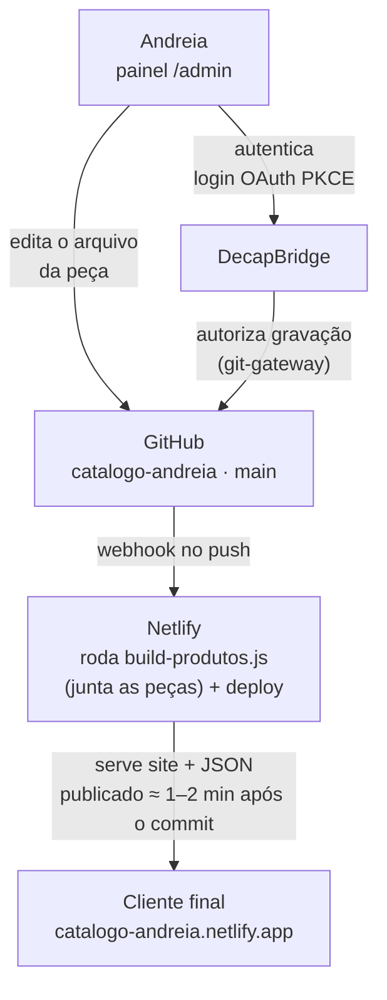

# Documentação técnica do catálogo e do painel admin

**ELIDAVY TECH · Referência interna**

Como o site, os dados de produto e o painel de edição da Andreia Pateis funcionam por
baixo do capô — pra consultar sempre que precisar mexer no projeto ou explicar uma
decisão pra alguém.

*Netlify + DecapBridge · Site estático, sem framework · Atualizado em 01/09/2026*

## Sumário

- [Sobre este documento](#sobre-este-documento)
- [01. Visão geral](#01-visão-geral)
- [02. Arquitetura](#02-arquitetura)
- [03. Fluxo de edição, passo a passo](#03-fluxo-de-edição-passo-a-passo)
- [04. Estrutura de pastas](#04-estrutura-de-pastas)
- [05. Painel admin](#05-painel-admin)
- [06. Decisões arquiteturais (ADRs)](#06-decisões-arquiteturais-adrs)
- [07. Segurança e acesso](#07-segurança-e-acesso)
- [08. Débito técnico conhecido](#08-débito-técnico-conhecido)
- [09. Histórico recente](#09-histórico-recente)

---

## Sobre este documento

Este documento descreve o **estado atual** do projeto — arquitetura, schema, fluxo de
deploy. É o complemento do índice de decisões em [`docs/adr/`](./adr/): lá fica o
*porquê* de cada escolha, registrado uma vez, no momento em que foi tomada, e nunca mais
editado depois de aceito; aqui fica o *o quê*, e este arquivo deve ser reescrito sempre
que necessário para continuar refletindo como o projeto funciona hoje, não como
funcionou no passado.

**Quando atualizar:** ao adicionar, remover ou mudar um campo do schema do produto
(§05); ao aceitar um ADR novo (acrescentar uma linha na tabela de §06 com um resumo de
2–3 frases e link para o arquivo — nunca copiar o texto completo do ADR pra cá, isso é o
que causa desatualização silenciosa); ao mudar a arquitetura, o fluxo de deploy ou a
estrutura de pastas (§02–§04); ao resolver ou identificar um item de débito técnico
(§08); ao mudar algo relacionado a segurança (§07).

**Como atualizar:** edite a seção correspondente diretamente neste arquivo, atualize a
data "Atualizado em" no topo, e — se a mudança for relevante para quem só lê por cima —
acrescente uma linha em §09.

## 01. Visão geral

O catálogo da Andreia Pateis é um site estático (HTML + CSS + JavaScript puro, sem
framework) hospedado no Netlify, com deploy automático a cada alteração enviada ao
GitHub. Cada peça vive em seu próprio arquivo JSON, dentro de
[`public/data/produtos/pecas/`](../public/data/produtos/pecas/) — não há banco de dados
externo. A Andreia edita cada peça sem tocar em código, através de um painel visual
(Decap CMS) que salva as mudanças direto no GitHub por trás dos panos; a cada
publicação, um script (`scripts/build-produtos.js`) junta todos os arquivos de peça num
único [`produtos.json`](../public/data/produtos/produtos.json), que é o arquivo que o
site de fato consulta (ver [ADR-0011](./adr/0011-folder-collection-um-arquivo-por-peca.md)).

Três serviços externos sustentam esse fluxo, cada um com um papel específico:

- **GitHub** — guarda o código-fonte e o arquivo de produtos; toda alteração vira um
  commit no histórico.
- **Netlify** — publica o site ao público e refaz o deploy automaticamente a cada novo
  commit em `main`.
- **DecapBridge** — cuida do login do painel admin (Google, Microsoft ou e-mail/senha) e
  autoriza o Decap CMS a gravar no GitHub em nome de quem está logado.

## 02. Arquitetura

Não existe backend próprio nem servidor sob gestão — os três serviços acima é que fazem
esse papel.

O painel admin nunca fala diretamente com o site publicado. Ele grava um commit no
GitHub; é o Netlify, observando esse repositório, quem detecta o push e refaz o deploy —
por isso uma edição no painel leva cerca de um a dois minutos para aparecer no site.

**Frontend público:** SPA (Single Page Application) em JavaScript puro. `index.html`
carrega [`script.js`](../public/js/script.js), que busca
[`produtos.json`](../public/data/produtos/produtos.json) por fetch assim que a página
abre e monta a grade, o carrinho e a ficha de cada produto inteiramente no navegador —
sem etapa de build.

**Fonte de dados:** cada peça é um arquivo JSON próprio em
[`public/data/produtos/pecas/`](../public/data/produtos/pecas/) — é aí que a Andreia
realmente cadastra e edita, e é isso que fica versionado como histórico real de cada
peça (ver [ADR-0011](./adr/0011-folder-collection-um-arquivo-por-peca.md)). O arquivo
[`produtos.json`](../public/data/produtos/produtos.json) que o site consome é *gerado*,
não editado à mão: ele é regravado do zero a cada publicação pelo script
`scripts/build-produtos.js`, então uma cópia dele parada no histórico do Git pode ficar
desatualizada entre uma publicação e outra sem que isso afete o site (ver §08). Não há
Firestore, nem qualquer outro banco externo.

## 03. Fluxo de edição, passo a passo

O que acontece tecnicamente entre a Andreia clicar em "Publicar" no painel e a alteração
aparecer no site:

1. Ela loga em `/admin` pelo Google, Microsoft ou e-mail/senha — o DecapBridge confere a
   identidade e devolve um token de acesso via OAuth PKCE.
2. O Decap CMS usa esse token pra falar com o git-gateway do DecapBridge, que tem
   permissão de gravação no repositório `catalogo-andreia` no GitHub.
3. Ao salvar, o painel grava (ou atualiza) só o arquivo JSON daquela peça, dentro de
   `public/data/produtos/pecas/`, e cria um commit direto na branch `main` — sem passar
   pelo computador de ninguém.
4. O GitHub avisa o Netlify (via webhook) que a `main` mudou.
5. O Netlify roda o comando de build definido em `netlify.toml`
   (`node scripts/build-produtos.js`), que junta todos os arquivos de
   `public/data/produtos/pecas/` num `produtos.json` novo, e então publica o conteúdo da
   pasta `public/` — não é um build no sentido de React/Next/Vite, é só essa junção de
   arquivos, rápida.
6. Na próxima vez que alguém abrir o catálogo, o `script.js` busca o `produtos.json`
   recém-gerado e a mudança aparece.

**Importante:** como o commit vai direto pro GitHub a partir do painel, um computador
que tenha o projeto clonado localmente (como o seu) pode ficar "atrasado" em relação ao
repositório remoto sempre que alguém usa o painel. É por isso que às vezes é preciso
rodar `git pull` antes de um `git push` — o Git está evitando que uma alteração local
sobrescreva sem querer uma edição feita pelo painel.

## 04. Estrutura de pastas

Só o que importa para operar o projeto — pastas de dependências e controle de versão
foram omitidas.
